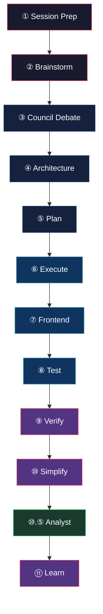

<div align="center">

[EN] | [한국어](docs/README.ko.md) | [日本語](docs/README.ja.md) | [繁體中文](docs/README.zh-TW.md)

# BMB — Be My Butler

**Multi-agent orchestration for Claude Code with cross-model blind verification**

[](CHANGELOG.md)
[](LICENSE)
[](CONTRIBUTING.md)
[](https://docs.anthropic.com/en/docs/claude-code)
[](#the-9-agents)
[](#the-115-step-pipeline)
[](WHATS-NEW-0.2.md)

<!-- TODO: Replace with asciinema recording -->
<!-- [](https://asciinema.org/a/TODO) -->

*Other AI coding tools optimize for speed. BMB optimizes for correctness.*

</div>

---

## Why BMB?

Solo AI coding assistants are fast — but they hallucinate, skip edge cases, and approve their own work. BMB fixes this by running **multiple specialized agents** that challenge, verify, and compress each other's output.

| Problem | BMB's Solution |
|---|---|
| **Self-review bias** | Cross-model blind verification — a different model reviews without seeing the original reasoning |
| **Design tunnel vision** | Council debate with AI challengers arguing alternatives before a single line is written |
| **Context explosion** | 3-layer compression protocol keeps token budgets tight across long pipelines |
| **"Works for me" testing** | Divergent framing — verifier receives a deliberately reworded spec to catch assumption leaks |
| **Lost knowledge** | FTS5 knowledge base + auto-learning promotes recurring lessons automatically |

> BMB doesn't replace your judgment — it gives you **9 opinionated experts** who argue before you decide.

---

## Quickstart

**Prerequisites:** [Claude Code CLI](https://docs.anthropic.com/en/docs/claude-code), `tmux`, `python3`, `sqlite3`, `git`

```bash
# 1. Install BMB
curl -fsSL https://raw.githubusercontent.com/project820/be-my-butler/main/install.sh | bash

# 2. Verify installation
bmb doctor

# 3. Run your first pipeline
#    Open Claude Code in any project and type:
/BMB
```

That's it. BMB registers its agents, skills, and scripts into your Claude Code environment. Type `/BMB` in any project to start the full 11.5-step pipeline.

> **Optional for cross-model verification:** Install [Codex CLI](https://github.com/openai/codex) and/or [Gemini CLI](https://github.com/google-gemini/gemini-cli) to unlock blind verification with a second model.

---

## The 11.5-Step Pipeline

Every `/BMB` run walks through these stages. Steps adapt based on the selected **recipe** — some steps are skipped or shortened for lighter workflows.



| Step | Agent | What Happens |
|---:|---|---|
| **1** | Lead | **Session Prep** — loads `session-prep.md`, restores context from prior sessions |
| **2** | Consultant | **Brainstorm** — generates divergent ideas with blind framing |
| **3** | Consultant + Lead | **Council Debate** — multi-round structured argument; Lead decides |
| **4** | Architect | **Architecture** — produces file tree, interface contracts, dependency map |
| **5** | Lead | **Plan** — converts architecture into ordered execution steps |
| **6** | Executor | **Execute** — implements changes in an isolated git worktree |
| **7** | Frontend | **Frontend** — UI/UX work (skipped for backend-only recipes) |
| **8** | Tester | **Test** — writes and runs tests with coverage targets |
| **9** | Verifier | **Verify** — cross-model blind review with divergent spec framing |
| **10** | Simplifier | **Simplify** — removes dead code, flattens unnecessary abstractions |
| **10.5** | Analyst | **Retrospective Analysis** — queries `analytics.db`, classifies events by Bird's Law severity, identifies promotion candidates from `pattern_counts` |
| **11** | Lead | **Learn** — extracts lessons into the 3-tier auto-learning system |

---

## Key Differentiators

<table>
<tr>
<td width="50%">

### Cross-Model Blind Verification
The Verifier agent sends your code to a **different model** (Codex or Gemini) with a deliberately **reworded specification**. If the second model finds issues the first missed, you know the solution has assumption leaks — not just bugs.

</td>
<td width="50%">

### Council Debate
Before any code is written, the Consultant and Lead engage in **multi-round structured debate**. The Consultant proposes alternatives, plays devil's advocate, and stress-tests assumptions. The Lead makes the final call — but only after hearing the opposition.

</td>
</tr>
<tr>
<td>

### Worktree Isolation
Each agent that writes code operates in its own **git worktree**. Parallel execution without merge conflicts. Changes are reviewed and merged only after verification passes.

</td>
<td>

### 3-Tier Auto-Learning
Lessons flow upward: **project-local** learnings (per-repo) → **global** learnings (cross-project) → **CLAUDE.md promotion** (permanent rules). Recurring mistakes automatically become enforced rules.

</td>
</tr>
<tr>
<td>

### 3-Layer Context Compression
Long pipelines bleed context. BMB compresses at three layers: **intra-step** (within each agent), **inter-step** (handoff summaries), and **session-level** (`session-prep.md` for continuity across conversations).

</td>
<td>

### Configurable Recipes
Not every task needs 11.5 steps. Pick a **recipe** to skip what you don't need — a bugfix skips brainstorm and council; a research task skips execution entirely.

</td>
</tr>
<tr>
<td>

### Analytics Layer + Bird's Law Severity
Every pipeline run emits structured telemetry to `analytics.db`. The Analyst (Step 10.5) queries `pattern_counts` to find recurring failures and classifies events by **Bird's Law severity** (critical / warn / info). Promotion candidates surface automatically after 2+ occurrences.

</td>
<td>

### Context7 for All Implementation Agents
Architect, Executor, and Frontend agents query **live library documentation** via Context7 MCP before writing code. No stale API assumptions — agents always write against the current SDK.

</td>
</tr>
</table>

---

## Recipes

| Recipe | Steps Used | Best For |
|---|---|---|
| `feature` | All 11 | New features, large changes |
| `bugfix` | 1 → 5 → 6 → 8 → 9 → 10 → 11 | Bug investigation and fix |
| `refactor` | 1 → 4 → 5 → 6 → 8 → 9 → 10 → 11 | Code restructuring |
| `research` | 1 → 2 → 3 → 11 | Exploration, spikes, design decisions |
| `review` | 1 → 9 → 11 | Code review only |
| `infra` | 1 → 4 → 5 → 6 → 8 → 9 → 11 | CI/CD, tooling, config changes |

---

## Slash Commands

| Command | Description |
|---|---|
| `/BMB` | Full 11.5-step pipeline — select a recipe interactively |
| `/BMB-brainstorm` | Brainstorm + Council only — explore ideas without executing |
| `/BMB-refactoring` | Refactor recipe shortcut — skip brainstorm, go straight to architecture |
| `/BMB-setup` | First-time project setup — generates `session-prep.md` and config |

---

## The 9 Agents

| Agent | Role | Model |
|---|---|---|
| **Lead** | Orchestrator, decision-maker, session continuity | Claude |
| **Consultant** | Coordinator: user advisor + pipeline monitor. Dual-channel (feed + SendMessage). Post-briefing analysis after blind phase. | Claude (i18n: en/ko/ja/zh-TW) |
| **Architect** | System design, file tree, contracts. Queries Context7 for live library docs. | Claude |
| **Executor** | Implementation in isolated worktree. Queries Context7 before writing. | Claude |
| **Frontend** | UI/UX implementation. Queries Context7 before writing. | Claude |
| **Tester** | Test writing and execution | Claude |
| **Verifier** | Cross-model blind review | Codex / Gemini / Claude |
| **Simplifier** | Dead code removal, complexity reduction | Claude |
| **Analyst** | Retrospective analytics: Bird's Law severity classification, `pattern_counts` promotion candidates | Claude (bypassPermissions, read-only) |

> The **Writer** agent handles documentation generation as a sub-role of the pipeline.

---

## Requirements

| Dependency | Required | Notes |
|---|---|---|
| [Claude Code CLI](https://docs.anthropic.com/en/docs/claude-code) | Yes | Core runtime |
| `tmux` | Yes | Agent session management |
| `python3` | Yes | Script tooling |
| `sqlite3` | Yes | FTS5 knowledge base |
| `git` | Yes | Worktree isolation |
| [Codex CLI](https://github.com/openai/codex) | Optional | Cross-model verification |
| [Gemini CLI](https://github.com/google-gemini/gemini-cli) | Optional | Cross-model verification |

Run `bmb doctor` after installation to verify all dependencies.

---

## Interactive Architecture Guide

Explore the full pipeline visually:

**[View Interactive Docs →](https://be-my-butler.github.io/be-my-butler/)**

---

## Project Structure

```
~/.claude/
├── skills/bmb/          # 4 slash command skills
├── agents/bmb-*.md      # 9 agent definitions (incl. bmb-analyst.md)
└── bmb-system/
    ├── config/          # Recipe configs, model assignments
    ├── scripts/         # cross-model-run.sh, bmb-learn.sh, bmb-analytics.sh
    └── templates/       # Session prep, handoff templates

.bmb/                    # Per-project runtime directory
├── analytics/
│   └── analytics.db     # SQLite: sessions, events, pattern_counts
└── handoffs/
    └── analyst-report.md  # Step 10.5 output
```

---

## Contributing

Contributions are welcome. Please read the [Contributing Guide](CONTRIBUTING.md) before submitting a PR.

1. Fork the repository
2. Create your feature branch (`git checkout -b feature/amazing-feature`)
3. Run the test suite (`bmb doctor && /BMB-setup`)
4. Commit your changes
5. Open a Pull Request

---

## License

[MIT](LICENSE) — use it however you want.

---

<div align="center">

**Built with obstinate attention to correctness.**

[Report Bug](https://github.com/project820/be-my-butler/issues) · [Request Feature](https://github.com/project820/be-my-butler/issues) · [Discussions](https://github.com/project820/be-my-butler/discussions)

</div>
