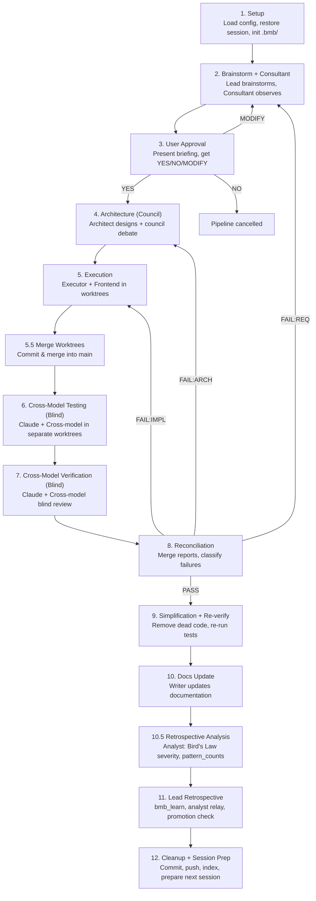

# BMB Architecture

## System Overview

BMB (Be My Butler) is a 12-step multi-agent orchestration pipeline for Claude Code. A single **Lead** agent spawns and coordinates 9 specialized agents through tmux panes, communicating exclusively via files in the `.bmb/` directory.

```mermaid
graph TB
    subgraph "tmux session"
        Lead["Lead (fixed pane)"]
        Consultant["Consultant (fixed pane)"]
    end

    subgraph "Ephemeral Panes (spawn → wait → kill)"
        Architect
        Executor
        Frontend
        Tester
        Verifier
        Simplifier
        Writer
        Analyst
    end

    subgraph ".bmb/ (handoff directory)"
        briefing["briefing.md"]
        plan["plan-to-exec.md"]
        execResult["exec-result.md"]
        testResult["test-result-*.md"]
        verifyResult["verify-result-*.md"]
        simplifyResult["simplify-result.md"]
        analystReport["analyst-report.md"]
        docsUpdate["docs-update.md"]
        config["config.json"]
        sessionLog["session-log.md"]
        analyticsDB[("analytics/analytics.db")]
    end

    Lead -->|writes| briefing
    Lead -->|reads all| .bmb/
    Consultant -.->|reads| briefing
    Architect -->|reads| briefing
    Architect -->|writes| plan
    Executor -->|reads| plan
    Executor -->|writes| execResult
    Frontend -->|reads| plan
    Frontend -->|writes| .bmb/
    Tester -->|reads| plan & briefing
    Tester -->|writes| testResult
    Verifier -->|reads| plan & briefing
    Verifier -->|writes| verifyResult
    Simplifier -->|reads| verifyResult
    Simplifier -->|writes| simplifyResult
    Writer -->|reads| .bmb/
    Writer -->|writes| docsUpdate
    Analyst -->|reads| analyticsDB
    Analyst -->|writes| analystReport
    Lead -->|emits events| analyticsDB
```



### Design Principles

- **Lead never writes code.** It only makes decisions and relays instructions.
- **All communication is file-based.** Agents never communicate directly -- every handoff goes through `.bmb/handoffs/`.
- **Agents are ephemeral.** Only Lead and Consultant persist. All other agents are spawned via `tmux split-pane`, polled for a result file, and killed when done.
- **Context protection.** Lead reads compressed summaries (max 300 tokens) rather than full handoff files to preserve its context window.
- **Unified permissions.** All spawned agents use `--permission-mode bypassPermissions`. The Lead constrains scope via prompt, not permission flags.
- **Structured telemetry.** Lead emits lifecycle events to `analytics.db` throughout the pipeline. The Analyst (Step 10.5) reads this DB and classifies events by Bird's Law severity.

---

## Agent Communication

```
.bmb/
├── config.json                    # Pipeline configuration
├── session-log.md                 # All agents append here
├── consultant-feed.md             # Lead → Consultant updates (dual-channel)
├── consultant-pane-id             # Consultant tmux pane ID
├── analytics/
│   └── analytics.db               # SQLite: sessions, events, pattern_counts
├── handoffs/
│   ├── briefing.md                # Step 2 output → Architect, Cross-model
│   ├── plan-to-exec.md            # Step 4 output → Executor, Claude Tester/Verifier
│   ├── exec-result.md             # Step 5 output
│   ├── frontend-result.md         # Step 5 output (conditional)
│   ├── test-result-claude.md      # Step 6 Track B
│   ├── test-result-cross.md       # Step 6 Track A
│   ├── verify-result-claude.md    # Step 7 Track B
│   ├── verify-result-cross.md     # Step 7 Track A
│   ├── verify-result.md           # Step 8 reconciled output
│   ├── simplify-result.md         # Step 9 output
│   ├── analyst-report.md          # Step 10.5 output
│   ├── analyst-report.summary.md  # Step 10.5 compressed summary
│   ├── docs-update.md             # Step 10 output
│   └── .compressed/               # L1 compressed summaries
├── worktrees/                     # Git worktrees per agent
├── councils/                      # Council debate records
├── sessions/                      # Per-session archives
│   ├── latest -> {session_id}
│   └── {session_id}/
│       ├── session-prep.md        # Continuity for next session
│       └── logger.pid
├── learnings.md                   # Project-local auto-learnings
└── knowledge.db                   # FTS5 indexed knowledge
```

**Rule: agents never read each other's result files directly.** The Lead reads, compresses, and relays relevant context through new handoff files or prompt injection at spawn time.

---

## 12-Step Pipeline Flow



Steps are **recipe-dependent** -- lighter recipes skip steps. See [recipes.md](recipes.md).

---

## Analytics Subsystem

The Lead agent is the **sole writer** to `analytics.db`. All other agents are read-only.

### Schema

```sql
-- One row per pipeline run
CREATE TABLE sessions (
  session_id TEXT PRIMARY KEY,
  project TEXT,
  recipe TEXT,
  started_at TEXT,
  ended_at TEXT,
  duration_sec INTEGER
);

-- One row per lifecycle event
CREATE TABLE events (
  id INTEGER PRIMARY KEY AUTOINCREMENT,
  session_id TEXT,
  step TEXT,
  step_seq INTEGER,          -- increments on repeated steps (fix loops)
  agent TEXT,
  event_type TEXT,           -- agent_spawn, agent_complete, agent_timeout, merge_conflict, ...
  severity TEXT,             -- info | warn | error | critical
  event_key TEXT,            -- step:agent:event_type (stable identifier)
  detail TEXT,
  duration_sec INTEGER,
  created_at TEXT
);

-- Aggregate counts per event_key across all sessions
CREATE TABLE pattern_counts (
  event_key TEXT PRIMARY KEY,
  count INTEGER DEFAULT 1,
  category TEXT,
  description TEXT,
  severity_max TEXT,
  first_seen TEXT,
  last_seen TEXT
);

-- External dependency incidents (v0.3.4)
-- Written by bin/codex shim and cross-model-run.sh to NDJSON spool;
-- imported into this table at pipeline start via bmb_analytics_import_incidents()
CREATE TABLE external_incidents (
  id INTEGER PRIMARY KEY AUTOINCREMENT,
  session_id TEXT,
  tool TEXT,                 -- codex, gemini, ...
  event_key TEXT,            -- auth_fail, stall, timeout, rate_limit, crash
  severity TEXT,             -- info | warn | error | critical
  exit_code INTEGER,
  detail TEXT,
  created_at TEXT
);
```

**Single-writer rule (v0.3.4):** The `bin/codex` shim and `cross-model-run.sh` write incidents to an NDJSON spool at `~/.claude/bmb-system/runtime/external-incidents.ndjson`. The Lead imports the spool into `external_incidents` at Step 1 via `bmb_analytics_import_incidents()` — ensuring SQLite always has a single writer (Lead only).

### Bird's Law Severity Model

Events are classified into four severity levels:

| Severity | Description | Examples |
|----------|-------------|---------|
| `critical` | Pipeline-blocking failure | merge_conflict requiring user intervention |
| `error` | Agent failure with fallback | agent_timeout, test suite crash |
| `warn` | Degraded execution | cross-model unavailable, timeout near limit |
| `info` | Normal lifecycle | agent_spawn, agent_complete, step transitions |

The Analyst (Step 10.5) filters `events` by severity and cross-references `pattern_counts` to identify recurring patterns eligible for promotion to `CLAUDE.md`.

### 3-Tier Reporting

At session end, the Lead reads the Analyst report and presents a tiered summary:

| Tier | Audience | Content |
|------|----------|---------|
| **Tier 1** | Lead (internal) | Full event log + pattern_counts |
| **Tier 2** | Consultant | Post-briefing summary (after blind phase only) |
| **Tier 3** | User | High-severity incidents + promotion candidates |

---

## Consultant — Coordinator Identity

The Consultant operates in two distinct modes:

| Mode | When | Receives |
|------|------|----------|
| **Active** | Steps 2–3 (brainstorm/council) | Full context, can send feedback |
| **Blind** | Steps 6–7 (testing/verification) | Lifecycle events only (no test payloads) |
| **Post-briefing** | After Step 8 reconciliation | Analyst report + full results |

**Dual-channel communication:**
1. **Feed file** (`consultant-feed.md`) — Lead writes context updates; Consultant reads on request
2. **SendMessage** — Lead pushes JSON lifecycle events directly to the Consultant pane

Fixed JSON templates for lifecycle events:
```json
{"event":"agent_spawn","step":"5","agent":"executor","timeout_sec":600,"ts":"14:03"}
{"event":"agent_complete","step":"5","agent":"executor","result":".bmb/handoffs/exec-result.md","ts":"14:09"}
{"event":"agent_timeout","step":"6","agent":"tester-cross","elapsed_sec":900,"ts":"14:15"}
{"event":"merge_conflict","step":"5.5","files":"executor","ts":"14:06","severity":"error","tier":"1"}
{"event":"recovery_attempt","step":"7","agent":"verifier-cross","attempt":1,"timeout_sec":300,"ts":"14:20"}
{"event":"cross_model_degraded","step":"7","agent":"verifier-cross","reason":"restart_failed","ts":"14:26"}
{"event":"external_incidents_imported","step":"1","count":3,"ts":"14:01"}
```

---

## Context7 Protocol

Architect, Executor, and Frontend agents must query live library documentation before writing any implementation code that uses third-party libraries.

```
1. mcp__context7__resolve-library-id  →  get canonical library ID
2. mcp__context7__query-docs          →  get current API docs
3. Write code against the actual current API
```

This prevents stale-SDK hallucination — a common failure mode when agents write against memorized (potentially outdated) API signatures.

---

## Blind Divergent Protocol

The core differentiator of BMB's verification strategy. During Steps 6 and 7, two tracks run in parallel with **deliberately different context**:

| Track | Model | Reads | Purpose |
|-------|-------|-------|---------|
| Track A (Cross-model) | Codex or Gemini | `briefing.md` + diff | Tests against **user intent** (no implementation bias) |
| Track B (Claude) | Claude | `plan-to-exec.md` + diff | Tests against **design spec** (implementation-aware) |

Both tracks are **blind** -- neither can read the other's output files. The naming convention enforces this: `*-claude.md` and `*-cross.md` files are mutually excluded.

**Why this works:** If a bug only appears when tested against the original user intent (briefing) but not against the design spec, it reveals an **assumption leak** -- the design diverged from what the user actually wanted.

The Consultant is also **isolated** during Steps 6-7. It only receives results after Step 8 reconciliation, preventing it from biasing the verification.

---

## Codex Shim + External Incident Pipeline (v0.3.4)

BMB wraps the real `codex` binary with a transparent Python shim (`bmb-system/bin/codex`) that intercepts failures without changing normal behavior.

### Incident Flow

```
bin/codex (shim)
  │  TTY passthrough for interactive mode
  │  Non-TTY: stream large output to temp file (not RAM buffer)
  │  Stall detection: output gap > 180s (primary) + CPU < 5% (auxiliary only)
  │  Auth failure detection: 401/auth patterns in stderr
  ▼
~/.claude/bmb-system/runtime/external-incidents.ndjson  (NDJSON spool)
  │  Single-line JSON per event
  │  Sanitized: strips Bearer tokens, sk-* keys, emails, home paths
  ▼
bmb_analytics_import_incidents()   (called at Step 1 init)
  │  Lead reads spool → INSERT into external_incidents + events + pattern_counts
  │  Only Lead writes to SQLite (single-writer rule preserved)
  ▼
Analyst (Step 10.5)
  └─ queries external_incidents + recovery_attempt events for dependency report
```

### Incident Types

| Event Key | Trigger | Severity |
|-----------|---------|---------|
| `auth_fail` | HTTP 401 or auth error in stderr | `error` |
| `stall` | No output for 180s + CPU < 5% | `warn` |
| `timeout` | Exit code 124 or elapsed > profile limit | `error` |
| `rate_limit` | HTTP 429 in stderr | `warn` |
| `crash` | Exit code > 128 (signal) | `critical` |

### Profile-Based Timeouts (v0.3.4)

Each cross-model profile has its own default timeout instead of sharing a flat 3600s:

| Profile | Default Timeout | Notes |
|---------|----------------|-------|
| `council` | 600s | Brainstorm plan review |
| `verify` | 600s | Blind verification |
| `review` | 600s | Architecture review |
| `test` | 1200s | Test execution |
| `exec-assist` | 3600s | Full execution assistance |
| `recovery_restart` | 300s | Bounded restart (< any profile timeout) |
| `targeted_reverify` | 600s | Re-verify after simplification |

---

## Worktree Lifecycle

Git worktrees provide **filesystem-level isolation** between agents that write code.

```
Step 4:   Create executor worktree (+ frontend if needed) from HEAD
          ├── .bmb/worktrees/executor/    (branch: bmb-executor-{session_id})
          └── .bmb/worktrees/frontend/    (branch: bmb-frontend-{session_id})

Step 5:   Agents write code in their worktrees (parallel-safe)

Step 5.5: Commit in each worktree → merge into main → remove worktrees
          On conflict: escalate to user, log MISTAKE learning

Step 6:   Create tester worktrees from merged HEAD
          ├── .bmb/worktrees/tester-claude/
          └── .bmb/worktrees/tester-cross/

Step 7:   Create verifier worktrees from merged HEAD
          ├── .bmb/worktrees/verifier-claude/
          └── .bmb/worktrees/verifier-cross/

Step 8+:  Remove ALL remaining worktrees (even on failure)
```

Naming convention: `bmb-{role}-{session_id}` for branch names, `.bmb/worktrees/{role}/` for paths.

Cleanup command (used at any failure point):
```bash
git worktree list | grep '.bmb/worktrees' | awk '{print $1}' | \
  xargs -I{} git worktree remove {} 2>/dev/null || true
```

---

## 3-Layer Compression

Long multi-agent pipelines exhaust context windows. BMB compresses at three layers:

### L1: Read-Time Summaries (`.bmb/handoffs/.compressed/`)

Before reading any handoff file, the Lead checks for a compressed summary (max 300 tokens). If missing, it generates one on first read:

```
Type: Architecture Plan
Scope: src/api/, src/models/
Key Decisions: REST over gRPC, PostgreSQL, no ORM
Risks: Migration complexity
Status: APPROVED
```

### L2: Write-Time Tool Cache (`.bmb/.tool-cache/`)

When cross-model agents produce verbose command output (>50 lines), the full output is written to `.tool-cache/` and only a structured summary is kept in the conversation. Triggered by `BMB_COMPRESS_OUTPUT=1`.

### L3: FTS5 Reference Index (`knowledge.db`)

Council decisions and handoff content are indexed into SQLite FTS5 tables after each session via `knowledge-index.sh`. This enables semantic search across past sessions:

- `decisions` table: topic, consensus, evidence, session_date
- `handoffs` table: agent, content, phase, source_file

Search via `knowledge-search.sh`:
```bash
~/.claude/bmb-system/scripts/knowledge-search.sh "database migration strategy"
```

---

## Auto-Learning 3-Tier System

Lessons are captured during the pipeline via `bmb_learn TYPE STEP "what" "rule"`:

| Tier | Location | Scope | Promotion |
|------|----------|-------|-----------|
| **Tier 1** | `.bmb/learnings.md` | Project-local | Automatic |
| **Tier 2** | `~/.claude/bmb-system/learnings-global.md` | Cross-project | Automatic (appended with project tag) |
| **Tier 3** | Project `CLAUDE.md` Learnings section | Permanent | Manual (Lead proposes after 2+ occurrences) |

Learning types:
- `MISTAKE` -- something went wrong; loaded as "Known Pitfalls" in Step 1
- `CORRECTION` -- user corrected the pipeline's output
- `PRAISE` -- something went well; reinforces current approach

At Step 11 (Retrospective), the Lead scans `learnings.md` for rules appearing 2+ times and proposes promotion to `CLAUDE.md`.

---

## Graceful Degradation

BMB never blocks on optional dependencies. If a capability is unavailable, the pipeline continues with reduced coverage:

| Component | Degraded Mode | Impact |
|-----------|--------------|--------|
| Cross-model CLI unavailable | Claude-only testing/verification | Loses blind divergent framing |
| Gemini unavailable but Codex works | Use Codex as cross-model | None (single provider sufficient) |
| Cross-model timeout (v0.3.4) | Recovery-first: one bounded restart (300s), then Claude-only | Minimal — single recovery attempt before degradation |
| Council debate timeout | Solo architecture (Claude only) | Loses adversarial design challenge |
| Frontend agent not needed | Skip frontend worktree/merge | None |
| `knowledge.db` corrupted | Delete and re-index | Loses past session search |
| `session-prep.md` missing | Fresh start (no continuity) | Loses prior session context |
| `analytics.db` missing | Analyst skips; logs warning to `session-log.md` | Loses pattern analysis for this session |
| NDJSON incident spool missing (v0.3.4) | Skip incident import; log warning | Loses off-session incident history |
| Context7 unavailable | Agents fall back to memorized API knowledge | Risk of stale-SDK errors |
| Telegram not configured | Skip notifications | No user alerts |

All degradation events are logged to `session-log.md` with timestamp.

---

## Mobile Landing Pages

Four locale-specific mobile landing pages live in `docs/` alongside the desktop index files:

| File | Locale | Canonical URL |
|------|--------|--------------|
| `docs/m.html` | EN | `.../m.html` |
| `docs/m.ko.html` | KO | `.../m.ko.html` |
| `docs/m.ja.html` | JA | `.../m.ja.html` |
| `docs/m.zh-TW.html` | ZH-TW | `.../m.zh-TW.html` |

### Structure

Each page contains **7 vertical-scroll cards** with `scroll-snap-type: y proximity`:

| # | Card | Content |
|---|------|---------|
| 1 | Cover | BMB logo, tagline, 9 Agents / 12 Steps / Cross-Model tags |
| 2 | Problem | 2×2 grid: Self-verification bias, Context explosion, Edge cases, Design tunnel vision |
| 3 | Pipeline | 4-phase flow (PLAN/BUILD/VERIFY/REFINE) with `/BMB` command prompt |
| 4 | Architecture | Simplified SVG: handoff flow, blind wall, worktree isolation |
| 5 | Killer Feature | Cross-model blind wall, Divergent Framing, Assumption Leak Detection |
| 6 | For Everyone | Expert panel (cyan) + Beginner panel (pink) |
| 7 | CTA | Stats, GitHub button, MIT license |

### Shared Assets

- **CSS**: Scoped under `.mobile-landing` class in `docs/bmb-shared.css` (+280 lines)
- **JS**: `docs/bmb-shared.js` — IntersectionObserver card reveal + topbar counter gated behind `body.mobile-landing` class check; language routing between `m.*.html` files
- **Links**: Each `docs/index*.html` file has a drawer link to the corresponding `m.*.html`

---

## Session Continuity

At Step 12 (Cleanup), the Lead generates `.bmb/sessions/{session_id}/session-prep.md`:

```markdown
# BMB Session Prep
Generated: 2026-03-10 15:30
Project: /Users/you/project
Previous Session: 20260310-143000

## Completed Work
- [x] Implemented REST API endpoints
- [x] Added integration tests

## Remaining Tasks
- [ ] Frontend form validation
- [ ] E2E tests

## Context for Next Session
- Architecture: REST + PostgreSQL, no ORM
- User preferences: prefers Korean console output
- Key files: src/api/routes.ts, src/models/user.ts

## Suggested Next Prompt
"프론트엔드 폼 검증과 E2E 테스트를 구현해주세요"
```

The symlink `.bmb/sessions/latest` always points to the most recent session. On next `/BMB` invocation, Step 1 detects and offers to resume.
