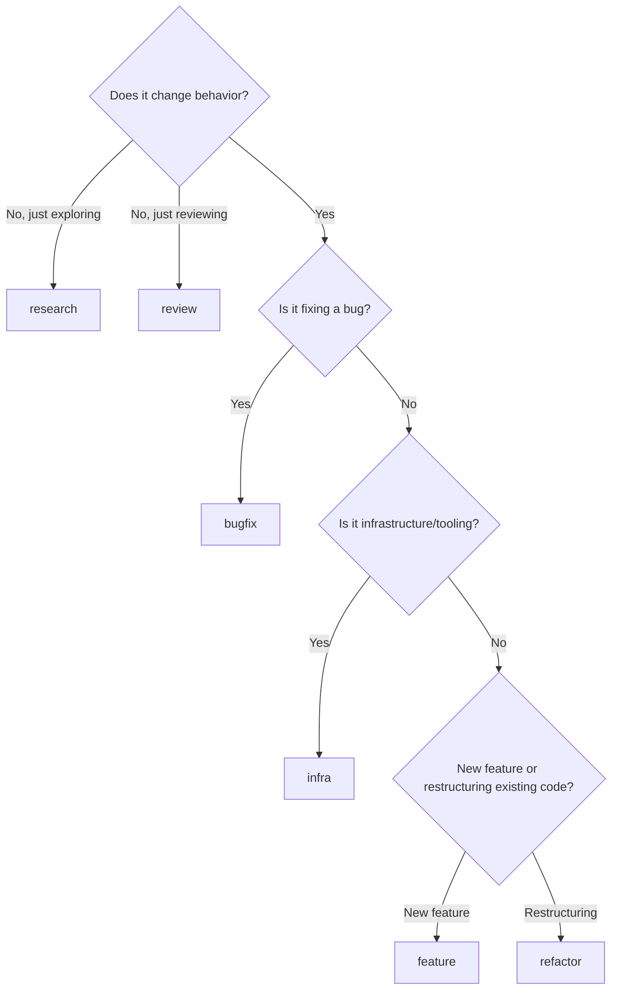

# BMB Recipes

Recipes control which pipeline steps are executed. Choose based on the task's scope and risk level.

---

## Recipe Summary

| Recipe | Steps | Council | Test | Verify | Simplify | Analyst | Frontend |
|--------|-------|---------|------|--------|----------|---------|----------|
| `feature` | All 11.5 | Yes | Yes (cross) | Yes (cross) | Yes | Yes | If needed |
| `bugfix` | 1-2-3-5-6-7-8-9-10-10.5-11 | No | Yes (cross) | Yes (cross) | No | Yes | No |
| `refactor` | 1-2-3-4-5-6-7-8-9-10-10.5-11 | Yes | No | Yes (cross) | Yes | Yes | If needed |
| `research` | 1-2-3 | No | No | No | No | No | No |
| `review` | 1-2-3-7-8 | No | No | Yes (review mode) | No | No | No |
| `infra` | 1-2-3-5-6-7-8-10-10.5-11 | No | Yes (cross) | Yes (cross) | No | Yes | No |

---

## feature

**When to use:** New features, significant enhancements, anything that adds user-facing behavior.

**Pipeline:**
```
Setup → Brainstorm → Approval → Architecture (Council) → Execution (+Frontend)
→ Cross-Model Test → Cross-Model Verify → Reconcile → Simplify → Analyst → Docs → Cleanup
```

**What makes it unique:** Full council debate before architecture. Both executor and frontend agents can run in parallel worktrees. Simplification pass removes any over-engineering introduced during execution. The Analyst (Step 10.5) runs a retrospective analysis on `analytics.db` to classify events by Bird's Law severity and surface promotion candidates.

**Estimated token cost:** 150k-400k tokens (depends on codebase size and council rounds)

**Example prompt:**
```
/BMB
사용자 프로필 페이지에 활동 히스토리 타임라인을 추가해주세요.
최근 30일 활동을 시간순으로 보여주고, 필터링 기능도 필요합니다.
```

---

## bugfix

**When to use:** Investigating and fixing a known bug. The root cause may or may not be clear.

**Pipeline:**
```
Setup → Brainstorm → Approval → Execution → Cross-Model Test
→ Cross-Model Verify → Reconcile → Analyst → Docs → Cleanup
```

**What makes it unique:** Skips council debate (the problem is known, not a design question). Skips frontend agent. Skips simplification (keep the fix minimal). Goes straight from brainstorm to execution. The Analyst still runs to track fix patterns.

**Estimated token cost:** 80k-200k tokens

**Example prompt:**
```
/BMB
API 응답에서 pagination offset이 0일 때 첫 페이지가 아닌 빈 배열을 반환하는 버그가 있습니다.
GET /api/posts?offset=0&limit=10 으로 재현됩니다.
```

---

## refactor

**When to use:** Restructuring code without changing behavior. Moving files, extracting modules, improving abstractions, reducing tech debt.

**Pipeline:**
```
Setup → Brainstorm → Approval → Architecture (Council) → Execution (+Frontend)
→ Cross-Model Verify → Reconcile → Simplify → Analyst → Docs → Cleanup
```

**What makes it unique:** Council debate is included (architectural decisions matter for refactoring). Testing step is skipped -- existing tests should pass, and the verifier checks this. Simplification is included to ensure the refactor actually reduced complexity. The Analyst identifies recurring refactoring patterns.

**Estimated token cost:** 120k-350k tokens

**Example prompt:**
```
/BMB
src/services/ 폴더의 모든 API 호출을 repository 패턴으로 리팩토링해주세요.
현재 각 서비스가 직접 fetch를 호출하고 있어서 테스트가 어렵습니다.
```

---

## research

**When to use:** Exploring options, making design decisions, evaluating technologies. No code will be written.

**Pipeline:**
```
Setup → Brainstorm → Approval (end)
```

**What makes it unique:** Only runs brainstorm with the Consultant. The output is a briefing document with analysis and recommendations. No agents are spawned, no worktrees are created.

**Estimated token cost:** 20k-60k tokens

**Example prompt:**
```
/BMB
Next.js App Router vs Pages Router 마이그레이션을 검토해주세요.
현재 Pages Router 기반이고, 점진적 마이그레이션이 가능한지 알고 싶습니다.
```

---

## review

**When to use:** Reviewing existing code or a PR without making changes. The Verifier runs in review mode (read-only analysis).

**Pipeline:**
```
Setup → Brainstorm → Approval → Cross-Model Verify (review mode) → Reconcile
```

**What makes it unique:** Brainstorm is used to understand the review scope. The Verifier operates in review mode -- it reads code and produces findings but never modifies files. Cross-model blind review applies: Claude and the cross-model each review independently with different context framing.

**Estimated token cost:** 40k-120k tokens

**Example prompt:**
```
/BMB
src/auth/ 디렉토리의 인증 로직을 보안 관점에서 리뷰해주세요.
특히 토큰 갱신 플로우와 세션 만료 처리를 중점적으로 봐주세요.
```

---

## infra

**When to use:** CI/CD pipelines, Docker configs, deployment scripts, tooling setup, configuration changes.

**Pipeline:**
```
Setup → Brainstorm → Approval → Execution → Cross-Model Test
→ Cross-Model Verify → Reconcile → Analyst → Docs → Cleanup
```

**What makes it unique:** Skips council debate (infra changes are typically well-defined). Skips frontend agent. Skips simplification. Includes testing and verification because infra bugs are high-impact. The Analyst tracks infra reliability patterns.

**Estimated token cost:** 80k-200k tokens

**Example prompt:**
```
/BMB
GitHub Actions CI에 lint + type-check + test 파이프라인을 설정해주세요.
PR마다 자동 실행되고, main 브랜치에는 추가로 deploy 스텝이 필요합니다.
```

---

## Choosing the Right Recipe



If unsure, start with `feature` -- it includes everything (all 11.5 steps). You can always cancel after the approval step if the scope was wrong.
